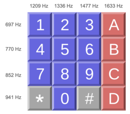
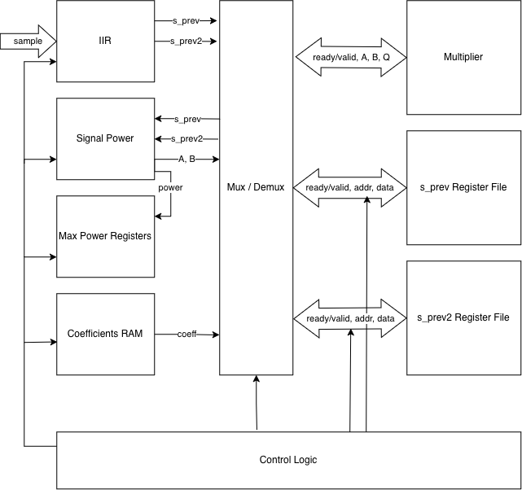
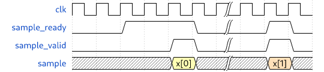

## How it works
Dual-Tone Multi Frequency (DTMF) signaling is a way of signaling between telephone equipment which uses two different frequencies to indicate which key has been pressed. 
You have probably heard DTMF in action when pressing the keypad buttons on a telephone. One frequency indicates the row of the pressed key in the keypad, and the other frequency indicates the column. The tone that is played is the combination of the two frequencies, which is the DTMF encoding of the key you just pressed.



The circuit works by implementing a discrete Fourier transform (DFT) using the Goertzel algorithm, which is standard for this use case.



### Description of algorithm

The Goertzel algorithm works based on sample blocks, which I chose to be 512 samples long for this project.

For each sample, we need to compute an intermediate sequence `s` with the following equation:
```math
s[n] = x[n] + C \cdot s[n-1] - s[n-2]
```
where `x[n]` is the sample value, and `C` is a coefficient based on the target frequency. Notice that this recurrence relation takes the form of an IIR filter with 2 previous states.

After `N` samples (`N = 512` in our case), we need to compute the final signal power with this equation
```math
P = s[N-1]^2 + s[N-2]^2 - C \cdot s[N-1] \cdot s[N-2]
```
Note that we only use the last two values of `s` for this calculation, which allows us to use only two registers to store the state of the filter.

This algorithm computes the signal power for a single frequency. In order to detect which key was pressed, 
We can detect which DTMF signal is being transmitted by calculating the power of each DTMF frequency in the input signal and determining which frequencies are the loudest. 
This will give us the detected row and column, and we can find out which key was pressed from the keypad shown above.

### Bit-width constraints

Because of the area constraints imposed by Tiny Tapeout, we needed to optimize the bit widths without sacrificing accuracy. For the coefficient `C` in the IIR stage, I chose a fixed point representation with 10 fractional bits, which was the minimum precision required to differentiate between all DTMF frequencies.

We decided on a bit width of 20 for the values of `s` from experimentation. With a block size of 512 and a max-amplitude audio sample, the values of `s` ranged from -160000 to 150000, requiring 19 bits to represent. With one extra bit for slack, we get a bit width of 20.

Notice that for the power calculations, we deal with values in the order of $s^2$. This will have resulted in values with very wide bit widths - around 40 bits. 
We work around this issue by right-shifting the values before we multiply them such that the result of the multiplication is reasonably scaled down. The loss of precision is acceptable because we only care about the relative magnitudes of the power values.

### Description of architecture

Conceptually, the chip needs to have 8 IIR filters for each of the 8 different DTMF frequencies.
For each sample, the chip needs to compute and store the next state of each of the IIR filters.

After each sample block, we need to use the final state from each of the IIR filters to compute the signal power of each of the DTMF frequencies to see which row and column frequency is the strongest. 
We then output the row and column indices and prepare for another sample block.

In reality, due to area constraints, it was hard to fit the state of 8 different IIR filters in the chip. Therefore, I chose to time-multiplex the chip for row and column computations separately.

We use one sample block to compute the _row_ with the strongest frequency, and the next sample block to compute the _column_ with the strongest frequency.
As a result, it will take __1024__ samples to compute the exact key that was pressed. At a sample rate of 44.1 kHz, we can expect to get the final result with 23 ms of audio.

With this change in place, we compute the next state of four IIR filters for each sample and the signal power of four frequencies for each sample block.
This allows us to store the state of only four IIR filters which cuts the register file in half.

## How to test

The chip takes unsigned 8-bit samples centered at 128 through a ready-valid handshake. When the chip signals that it is ready for a new sample, it will wait until the `sample_valid` signal is asserted, then latch the value in `ui_in` as the new sample.

Note that the chip expects samples taken at a 44.1 kHz sampling rate. Samples taken at any other sample rate will not work.



Due to the bit-serial nature of the multiplier, expect to wait up to 100 cycles between `sample_ready` assertions.

After feeding in 1024 samples, the chip will assert `valid`. Verify that the number outputted is the same as what is expected from the audio file.
